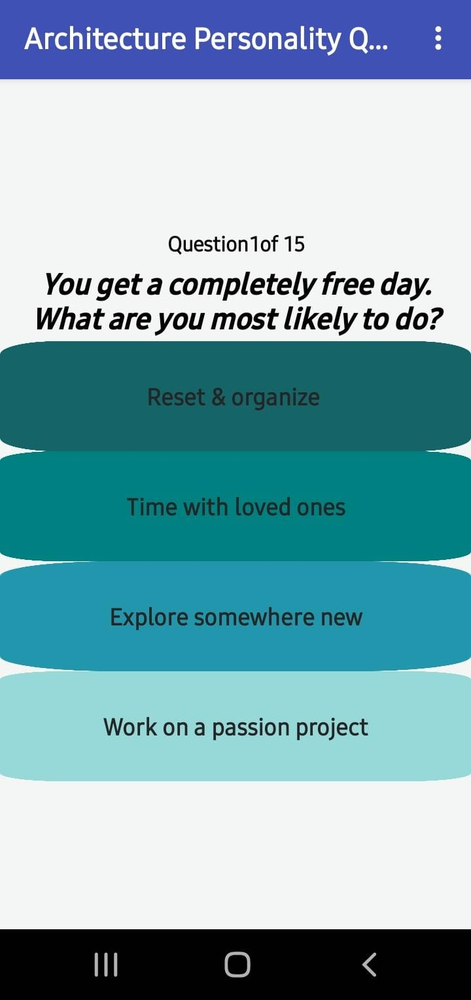
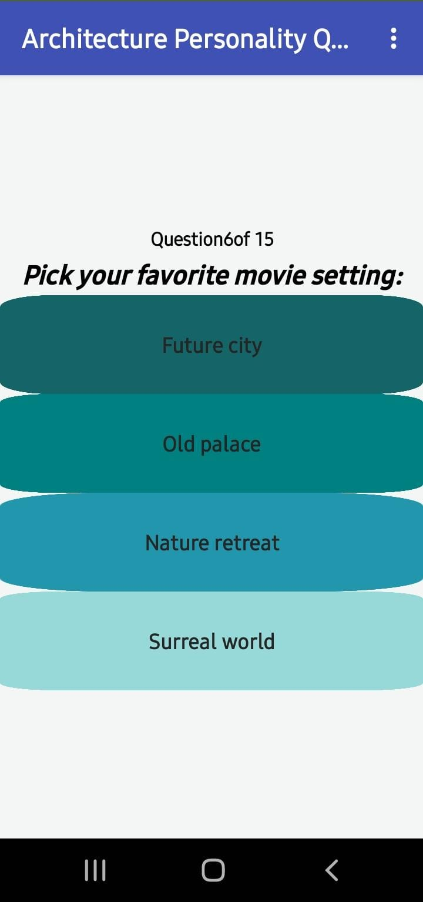

# 🏛 Architecture Personality Quiz (MIT App Inventor)

A mobile quiz application built using MIT App Inventor that predicts which architectural style best matches your personality.

This app uses a dynamic weighted scoring system and nested list architecture to produce scalable and maintainable results.

---

## 📱 App Overview

The user answers 15 personality-based questions.  
Each selected option contributes weighted points to multiple architectural styles.

At the end of the quiz:
- The app calculates the highest scoring style
- Displays a personality description
- Shows a corresponding architectural image

---

## 🖼 Screenshots

### 🏠 Home / Question Screen

### ❓ Quiz in Progress

### 🎉 Result Screen

---

## 🧠 Scoring Logic Architecture

The application uses a dynamic nested-list architecture for scalable, maintainable scoring logic.

### 🔹 Core Data Structures

- `styleCodes`  
  → Stores architectural style identifiers  

- `styleScores`  
  → Stores cumulative scores (parallel to styleCodes)

- `scoreMap`  
  → A nested list structured as:
  Question → Option → [StyleCode1, StyleCode2, StyleCode3]
  For example:

Question 1:
    Option A → ["MIN", "TEC", "BRU"]
    Option B → ["KER", "VIC", "FRA"]
    Option C → ["NOU", "DECO", "GOT"]
    Option D → ["DEC", "MIN", "TEC"]
  
---

### 🔹 How Scoring Works

1. Each question has 4 options.
2. Each option contributes points to 3 architectural styles.
3. When a user selects an option:
   - The related style list is retrieved from `scoreMap`
   - Scores for corresponding styles are incremented dynamically.
4. At quiz completion:
   - The app loops through `styleScores`
   - Detects the maximum value
   - Displays the associated architectural result and image

No large hardcoded scoring conditions were used.  
The structure allows easy expansion (more questions or styles can be added without restructuring the logic).

---

## 🏛 Architectural Styles Included

- Kerala Courtyard House  
- Gothic  
- Brutalist  
- Japanese Minimalism  
- Deconstructivist  
- Art Nouveau  
- Victorian  
- French Chateau  
- Art Deco  
- High-Tech / Futuristic  

Each result includes:
- Personality explanation
- Visual representation
- Thematic alignment

---

## 🛠 Built With

- MIT App Inventor  
- List-based scoring structure  
- Dynamic winner detection loop  
- Conditional result rendering  

---

## 📂 Project File

Download the `.aia` file from this repository and import it into:

https://ai2.appinventor.mit.edu

Steps:
1. Open MIT App Inventor
2. Click **Projects**
3. Click **Import project (.aia) from my computer**
4. Select the downloaded file

---

## 🚀 Key Highlight

This project demonstrates:

- Data-structure-driven design
- Scalable quiz scoring logic
- UI-component control using conditional rendering
- Beginner-to-intermediate mobile app architecture using block-based logic

---

## 📌 Future Improvements

- Background theme change based on result  
- Share result functionality  
- Animated transitions  
- Expanded question bank  

---

